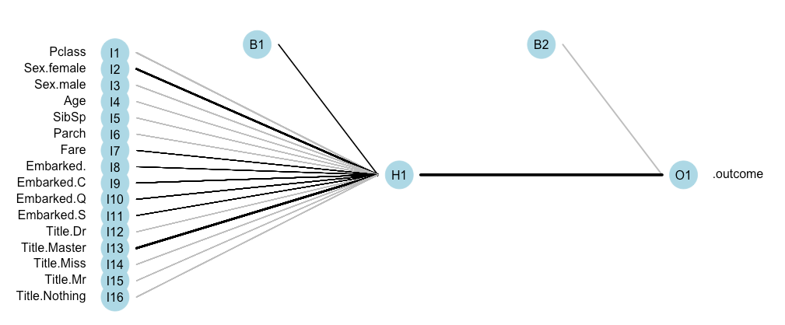

# Kaggle - Titanic Survival Prediction

#### By Marcus Williamson - 02/09/15

Please see Kaggle Competition [here](https://www.kaggle.com/c/titanic)

>The sinking of the RMS Titanic is one of the most infamous shipwrecks in history.  On April 15, 1912, during her maiden voyage, the Titanic sank after colliding with an iceberg, killing 1502 out of 2224 passengers and crew. This sensational tragedy shocked the international community and led to better safety regulations for ships.
>
>One of the reasons that the shipwreck led to such loss of life was that there were not enough lifeboats for the passengers and crew. Although there was some element of luck involved in surviving the sinking, some groups of people were more likely to survive than others, such as women, children, and the upper-class.
>
>In this challenge, we ask you to complete the analysis of what sorts of people were likely to survive. In particular, we ask you to apply the tools of machine learning to predict which passengers survived the tragedy.


### Importing and Cleaning Data

We begin by importing our libraries that we may need to use during the analysis and model creation, we will be comparing a wide variety of models:
```r
library(lattice)
library(ggplot2)
library(caret)
library(randomForest)
library(NeuralNetTools)
library(rpart) 
library(rpart.plot)
library(kernlab)
library(foreach)
library(iterators)
library(parallel)
library(doParallel)
library(nnet)
library(e1071)
library(MASS)
library(Matrix)
library(lme4)
library(arm)
library(survival)
library(splines)
library(gbm)
library(plyr)
library(klaR)
library(ipred)
```
We also set our seed for **reproduciblity of results** and number of cores available for processing with: 
```r
set.seed(8484) 
registerDoMC(cores = 8) # for parallel processing
```

Next we import our data from the source links into our R environment, a saved CSV copy can be found in the Data folder within the repository.
```r
rawdata = read.csv("train.csv", header = TRUE)
```

Taking an initial look at our data:
```r
dim(rawdata)
view(rawdata)
```
```
[1] 891  12
```

Under further visual inspection, it reveals variables in the raw data import that are not useful in prediction and are difficult to work with in a Machine Learning problem, so we proceed to clean the datasets:
```r
Survived <- as.factor(rawdata$Survived) #Set as factor and keep separate

#Extract title from name. discard the rest (we only use frequently used titles e.g ignore Revr as we only have 6 entries for this title)
rawdata$Title <- ifelse(grepl('Mr.',rawdata$Name),'Mr',ifelse(grepl('Mrs.',rawdata$Name),'Mrs',ifelse(grepl('Master.',rawdata$Name),'Master',ifelse(grepl('Dr.',rawdata$Name),'Dr',ifelse(grepl('Miss.',rawdata$Name),'Miss','Nothing')))))

#Replace N/A ages with median age, so we dont lose these data entries
rawdata$Age[is.na(rawdata$Age)] <- median(rawdata$Age, na.rm=T)

rawdata$Title <- as.factor(rawdata$Title) #Set as factor

names <- grepl("Name|Ticket|Cabin|PassengerId", colnames(rawdata)) #getting all non predictive variables column names

rawdata = rawdata[,!names] # removing these columns

#create dummy variables for text factors (e.g male female becomes two variables with binary response)
rawdataDummy <- dummyVars("~.",data=rawdata, fullRank=F)

#populate data with the new & existing variables
data <- as.data.frame(predict(rawdataDummy,rawdata))

data$Survived <- Survived # reattach our survival outcome (so it was unaffected by dummy Vars)
```
---

### Data Partitioning 

We split our training data into training and validation sets as we seek to implement [Cross Validation]( https://en.wikipedia.org/wiki/Cross-validation_(statistics) ) in this model. We choose a 70:30 split for our sets to ensure we have a suitable amount of data in each, and to reduce the variance in the parameter estimates. This is also roughly in line with the split of 60% Training 20% Validation (scaling up to give a 75:25 split).
```r
inTrain <- createDataPartition(y=data$Survived,p=0.70, list=FALSE)

training_part <- data[inTrain,] # 70% of data for training
testing_part <- data[-inTrain,] # 30% of data for later validation
```
---

##Preparing to compare multiple models

We create a vector to capture the different performances of the models, and set the Cross Validation settings with [Principle Component Analysis]() repeated 10 times
```r
# create an empty numeric vector to calculate out of sample error against
outOfSampleError <- numeric()

# add some parameters for train control
TC <- trainControl(method = "cv", number = 12, returnData=FALSE, returnResamp="none", savePredictions=FALSE, verboseIter=FALSE , preProcOptions="pca", allowParallel=TRUE)
```

### Creating the Models

We build a wide variety of models, credit to [Nick Lust](https://github.com/nicklusk) for original script:

* [Bayesian GLM](https://www.unt.edu/rss/class/Jon/Benchmarks/BayesGLM_JDS_Jan2011.pdf)
* [Generalized Boosted Regression](http://www.saedsayad.com/docs/gbm2.pdf)
* [K Nearest Neighbor](http://blog.webagesolutions.com/archives/1164)
* [Naive Bayes](https://en.wikipedia.org/wiki/Naive_Bayes_classifier)
* [Neural Net](https://en.wikipedia.org/wiki/Artificial_neural_network)
* [Random Forest](https://en.wikipedia.org/wiki/Random_forest)
* [Recursive Partitioning and Regression Trees](https://en.wikipedia.org/wiki/Recursive_partitioning)
* [Support Vector Machines Linear](https://en.wikipedia.org/wiki/Support_vector_machine#Linear_SVM)
* [Support Vector Machines Radial](https://en.wikipedia.org/wiki/Support_vector_machine#Nonlinear_classification)
* [Bagged Classification and Regression Trees](https://en.wikipedia.org/wiki/Bootstrap_aggregating)

```r
#For each model: btrain, predict, calculate accuracy and out of sample error

#Bayesian
bayes <- train(Survived ~ ., method="bayesglm", data=training_part, trControl= TC)
bayesglmPrediction <- predict(bayes, testing_part)
bayesglmAccuracy <- sum(bayesglmPrediction == testing_part$Survived) / length(bayesglmPrediction)
bayesglmOutOfSampleError <- c(outOfSampleError, 1-bayesglmAccuracy)

#Generalized Boosted Regression
gbm <- train(Survived ~ ., method="gbm", data=training_part, trControl= TC)
gbmPrediction <- predict(gbm, testing_part)
gbmAccuracy <- sum(gbmPrediction == testing_part$Survived) / length(gbmPrediction)
gbmOutOfSampleError <- c(outOfSampleError, 1-gbmAccuracy)

#K Nearest Neighbor
knn <- train(Survived ~ ., method="knn", data=training_part, trControl= TC)
knnPrediction <- predict(knn, testing_part)
knnAccuracy <- sum(knnPrediction == testing_part$Survived) / length(knnPrediction)
knnOutOfSampleError <- c(outOfSampleError, 1-knnAccuracy)

#Naive Bayes
nb <- train(Survived ~ ., method="nb", data=training_part, trControl= TC)
nbPrediction <- predict(nb, testing_part)
nbAccuracy <- sum(nbPrediction == testing_part$Survived) / length(nbPrediction)
nbOutOfSampleError <- c(outOfSampleError, 1-nbAccuracy)

#Neural Net
nnet <- train(Survived ~ ., method="nnet", data=training_part, trControl= TC)
nnetPrediction <- predict(nnet, testing_part)
nnetAccuracy <- sum(nnetPrediction == testing_part$Survived) / length(nnetPrediction)
nnetOutOfSampleError <- c(outOfSampleError, 1-nnetAccuracy)

#Random Forest
rf <- train(Survived ~ ., method="rf", data=training_part, trControl= TC)
rfPrediction <- predict(rf, testing_part)
rfAccuracy <- sum(rfPrediction == testing_part$Survived) / length(rfPrediction)
rfOutOfSampleError <- c(outOfSampleError, 1-rfAccuracy)

#Recursive Partitioning and Regression Trees
rpart <- train(Survived ~ ., method="rpart", data=training_part, trControl= TC)
rpartPrediction <- predict(rpart, testing_part)
rpartAccuracy <- sum(rpartPrediction == testing_part$Survived) / length(rpartPrediction)
rpartOutOfSampleError <- c(outOfSampleError, 1-rpartAccuracy)

#Support Vector Machines Linear
svml <- train(Survived ~ ., method="svmLinear", data=training_part, trControl= TC)
svmlPrediction <- predict(svml, testing_part)
svmlAccuracy <- sum(svmlPrediction == testing_part$Survived) / length(svmlPrediction)
svmlOutOfSampleError <- c(outOfSampleError, 1-svmlAccuracy)

#Support Vector Machines Radial
svmr <- train(Survived ~ ., method="svmRadial", data=training_part, trControl= TC)
svmrPrediction <- predict(svmr, testing_part)
svmrAccuracy <- sum(svmrPrediction == testing_part$Survived) / length(svmrPrediction)
svmrOutOfSampleError <- c(outOfSampleError, 1-svmrAccuracy)

#Bagged Classification and Regression Trees
treebag <- train(Survived ~ ., method="treebag", data=training_part, trControl= TC)
treebagPrediction <- predict(treebag, testing_part)
treebagAccuracy <- sum(treebagPrediction == testing_part$Survived) / length(treebagPrediction)
treebagOutOfSampleError <- c(outOfSampleError, 1-treebagAccuracy)


#Results
trainMethods <- c("Bayesian GLM", "Generalized Boosted Regression", "K Nearest Neighbor", "Naive Bayes", "Neural Net", "Random Forest", "Recursive Partitioning and Regression Trees", "Support Vector Machines Linear", "Support Vector Machines Radial", "Bagged Classification and Regression Trees")
accuracy <- c(bayesglmAccuracy, gbmAccuracy, knnAccuracy, nbAccuracy, nnetAccuracy, rfAccuracy, rpartAccuracy, svmlAccuracy, svmrAccuracy, treebagAccuracy)
outOfSampleError <- c(bayesglmOutOfSampleError, gbmOutOfSampleError, knnOutOfSampleError, nbOutOfSampleError, nnetOutOfSampleError, rfOutOfSampleError, rpartOutOfSampleError, svmlOutOfSampleError, svmrOutOfSampleError, treebagOutOfSampleError)

results <- data.frame(trainMethods, accuracy, outOfSampleError)
results[order(results$accuracy),]
```
```
                                  trainMethods     accuracy outOfSampleError
9               Support Vector Machines Radial 0.7142857143     0.2857142857
3                           K Nearest Neighbor 0.7368421053     0.2631578947
4                                  Naive Bayes 0.7481203008     0.2518796992
7  Recursive Partitioning and Regression Trees 0.8045112782     0.1954887218
10  Bagged Classification and Regression Trees 0.8082706767     0.1917293233
2               Generalized Boosted Regression 0.8233082707     0.1766917293
1                                 Bayesian GLM 0.8270676692     0.1729323308
8               Support Vector Machines Linear 0.8308270677     0.1691729323
6                                Random Forest 0.8345864662     0.1654135338
5                                   Neural Net 0.8383458647     0.1616541353
```
---

### Model Accuracy's and Out of Sample Errors

Our selected Neural Network model has an **estimated accuracy** of **83.83%** and an **estimated out of sample error** of **0.16%**.

Looking at the confusion matrix:
```r
#Cross-validation
predictCrossVal <- predict(nnet, testing_part)
confusionMatrix(testing_part$Survived, predictCrossVal)
```
```r
Confusion Matrix and Statistics

          Reference
Prediction   0   1
         0 149  15
         1  28  74
                                               
               Accuracy : 0.8383459            
                 95% CI : (0.788495, 0.8804722)
    No Information Rate : 0.6654135            
    P-Value [Acc > NIR] : 0.0000000001725153   
                                               
                  Kappa : 0.6496784            
 Mcnemar's Test P-Value : 0.0672525            
                                               
            Sensitivity : 0.8418079            
            Specificity : 0.8314607            
         Pos Pred Value : 0.9085366            
         Neg Pred Value : 0.7254902            
             Prevalence : 0.6654135            
         Detection Rate : 0.5601504            
   Detection Prevalence : 0.6165414            
      Balanced Accuracy : 0.8366343            
                                               
       'Positive' Class : 0   
```

We visualise the network below:
```r
#Plot our trained Neural Network
plotnet(nnet,node_labs = TRUE,var_labs = TRUE)
```


---

### Predicting on unseen data

We load in the test data and use our trained Neural Network to predict if the passenger survived or not:

```r
rawtestdata = read.csv("Data/test.csv", header = TRUE) #Load in test data

#Extract title from name. discard the rest
rawtestdata$Title <- ifelse(grepl('Mr.',rawtestdata$Name),'Mr',ifelse(grepl('Mrs.',rawtestdata$Name),'Mrs',ifelse(grepl('Master.',rawtestdata$Name),'Master',ifelse(grepl('Dr.',rawtestdata$Name),'Dr',ifelse(grepl('Miss.',rawtestdata$Name),'Miss','Nothing')))))

rawtestdata$Title <- as.factor(rawtestdata$Title) #Set as factor

names <- grepl("Name|Ticket|Cabin|PassengerId", colnames(rawtestdata)) # getting all non predictive variables column names

rawtestdata = rawtestdata[,!names] # removing columns

rawtestdataDummy <- dummyVars("~.",data=rawtestdata, fullRank=F)

test <- as.data.frame(predict(rawtestdataDummy,rawtestdata))

#Generate 'unknown' embarked column
test$Embarked. = 0

##Predict survivors!
survived <- predict(nnet, test)
survived
```
```
[1] 0 0 0 0 1 0 1 0 1 0 0 1 0 1 1 0 0 0 1 0 1 1 1 0 1 0 0 0 0 0 0 0 1 0 0 0 1 1 0 0 1 1 0 0 1 1 0 0 0 1 0 0 0 1 1 1 0
 [58] 1 1 1 0 1 1 1 1 1 0 1 1 0 0 1 1 1 1 1 1 0 1 0 1 0 1 0 0 1 0 0 0 0 1 1 1 0 1 0 1 1 1 0 1 0 0 0 0 0 0 0 0 0 1 0 0 1
[115] 0 0 0 0 0 0 1 1 0 0 1 1 0 1 1 1 0 1 0 0 1 0 0 0 1 1 0 1 1 0 0 1 1 0 1 0 0 0 1 0 1 0 1 1 0 1 0 1 0 1 0 1 0 0 0 1 0
[172] 0 0 1 1 0 1 0 1 0 0 0 0 1 0 0 0 0 0 1 1 1 1 0 0 1 0 1 1 0 0 0 0 0 1 0 0 0 1 1 0 0 0 1 1 0 0 0 0 1 1 1 1 0 0 1 0 0
[229] 0 1 0 0 0 0 0 1 0 1 0 0 0 0 1 1 1 0 0 0 0 0 0 0 0 1 0 1 0 0 0 1 0 1 0 0 0 0 0 0 0 1 1 0 1 0 1 1 0 0 0 1 0 1 1 0 1
[286] 1 0 1 1 1 0 0 1 0 0 1 1 0 0 0 0 0 1 1 0 0 0 0 0 1 1 0 0 1 0 1 0 0 1 0 1 1 0 0 0 0 1 1 1 1 0
Levels: 0 1
```

The predictions are now output to CSV and uploaded to Kaggle!
```r
titanic.df = as.data.frame(survived)
write.csv(titanic.df, file = "submission.csv")   
```
